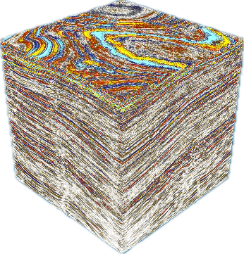
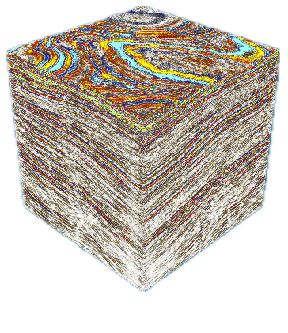

<div align="center">



# SeismicFlow

**The First Production-Grade Python-Native GUI Platform for Integrated Geoscience Workflows**

[](https://doi.org/10.1190/GEO-2025-1020)
[](https://doi.org/10.1190/GEO-2025-1020)
[](LICENSE)
[](#system-requirements)
[](#system-requirements)



*A 3D seismic volume rendered inside SeismicFlow*

</div>

---

SeismicFlow is a standalone GUI application for geophysical and well data analysis, designed for scientists and researchers who want flexibility in algorithm development — seismic interpretation, well logs, and a full machine-learning toolkit in a single native Python app.

**Site:** [seismicflow.github.io](https://seismicflow.github.io) · **Contact:** [seismicflowinc@gmail.com](mailto:seismicflowinc@gmail.com) · **YouTube:** [@Seismicflow-inc](https://www.youtube.com/@Seismicflow-inc)

## Contents

- [Why SeismicFlow](#why-seismicflow)
- [Tutorials](#tutorials)
- [Citation](#citation)
- [System Requirements](#system-requirements)
- [Required Files](#required-files)
- [Installation](#installation)
- [How It Works](#how-it-works)
- [GPU Acceleration Setup](#gpu-acceleration-setup-optional)
- [Troubleshooting](#troubleshooting)
- [Uninstallation](#uninstallation)
- [Verification](#verification)
- [Example Dataset](#example-dataset)
- [Technical Details](#technical-details)
- [Support](#support)

## Why SeismicFlow

- 🧩 **Integrated Workflows** — seismic interpretation, well log analysis, and machine learning live in one application, no exporting between tools.
- 🤖 **Built-in ML & AI** — PyTorch, TensorFlow, XGBoost, CatBoost, LightGBM, and TabNet, ready to use out of the box.
- 🧊 **3D Visualization** — hardware-accelerated rendering of seismic volumes, powered by VTK and OpenGL.
- 📡 **SEG-Y & Well Data** — native support for industry-standard formats via `segyio`, with geospatial tooling built in via `pyproj`.
- ⚡ **GPU-Accelerated, CPU-Ready** — optional CUDA acceleration for neural network workloads; every feature also runs fully on CPU.
- 🆓 **Free & Open Source** — GPL-3.0 licensed and peer-reviewed, no license fees, no vendor lock-in.

## Tutorials

<div align="center">

[](https://www.youtube.com/watch?v=ffbvSpZ_S_E)
[](https://www.youtube.com/watch?v=OksKVXDVJkY)

[](https://www.youtube.com/watch?v=ujZ7r0A36G8)
[](https://www.youtube.com/watch?v=23w2LFARhwA)

More on the [SeismicFlow YouTube channel](https://www.youtube.com/@Seismicflow-inc).

</div>

## Citation

SeismicFlow has been peer-reviewed and published in *Geophysics*:

> Mahzad, M. (2026). SeismicFlow: The first production-grade Python-native GUI platform for integrated geoscience workflows. *Geophysics*, 91(6), F13–F21. https://doi.org/10.1190/GEO-2025-1020

If SeismicFlow is useful in your research, please cite the paper above. BibTeX:

```bibtex
@article{Mahzad2026SeismicFlow,
  author  = {Mahzad, M.},
  title   = {SeismicFlow: The first production-grade Python-native GUI platform for integrated geoscience workflows},
  journal = {Geophysics},
  year    = {2026},
  volume  = {91},
  number  = {6},
  pages   = {F13--F21},
  doi     = {10.1190/GEO-2025-1020}
}
```

## System Requirements

| | Requirement |
|---|---|
| **Operating System** | Windows 10/11 (64-bit) or Linux (modern 64-bit distributions) |
| **Python** | Any version to run the installer — Windows gets a portable Python 3.10 automatically; Linux uses your system Python (3.10 preferred) |
| **Disk Space** | ~8 GB for a complete installation |
| **GPU** | Optional — NVIDIA GPU with CUDA 11.7 speeds up neural network processing. Every feature works on CPU only, just slower for ML tasks. The installer tries a GPU-enabled PyTorch install first and falls back to CPU-only automatically if it times out or fails. |

## Required Files

Download **all** of these files from the repository and place them in the same folder:

**Application files:** `SeismicFlow.py` · `install.py` · `requirements.txt`

**GUI assets (required):** `splash.png` · `white_terminal.png` · `black_terminal.png` · `busy.gif` · `busy.png` · `icon.png`

> All files must be in the same directory for the application to work properly.

## Installation

This method is **completely self-contained** and will not affect any existing Python installations on your system. The installer detects Windows vs. Linux automatically — no manual configuration needed.

**1. Download all files** into a folder where you want SeismicFlow installed (e.g. `C:\SeismicFlow` on Windows, `~/SeismicFlow` on Linux).

**2. Run the installer** from a terminal in that folder — any Python you already have installed works:

```bash
python install.py
```

**3. Launch SeismicFlow:**
- **Windows** — double-click `SeismicFlow.bat`
- **Linux** — run `./SeismicFlow.sh`

<details>
<summary><strong>What the installer does on Windows</strong></summary>

1. Downloads a portable Python 3.10 (no administrator rights needed)
2. Creates an isolated virtual environment
3. Installs PyTorch 2.0.0 with CUDA 11.7 support (falls back to CPU-only automatically if it fails or times out)
4. Installs TensorFlow 2.10.1
5. Installs all other dependencies from `requirements.txt`
6. Creates the `SeismicFlow.bat` launcher

</details>

<details>
<summary><strong>What the installer does on Linux</strong></summary>

1. Locates your system Python (3.10 preferred)
2. Creates a standard virtual environment with `virtualenv`
3. Installs PyTorch 2.0.0 with CUDA 11.7 support (falls back to CPU-only automatically if it fails or times out)
4. Installs TensorFlow 2.10.1
5. Installs all other dependencies from `requirements.txt`, automatically excluding Windows-only packages (e.g. `pywin32`)
6. Creates the `SeismicFlow.sh` launcher

</details>

Everything is self-contained — the installer builds a complete Python environment inside your chosen directory. Your system Python and other projects are never touched.

## How It Works

```
YourFolder/
├── SeismicFlow.py          (main application)
├── install.py              (installer script)
├── requirements.txt        (dependencies)
├── splash.png              (GUI asset)
├── white_terminal.png      (GUI asset)
├── black_terminal.png      (GUI asset)
├── busy.gif                (GUI asset)
├── busy.png                (GUI asset)
├── icon.png                (GUI asset)
├── python310/              (portable Python — Windows only, created by installer)
├── venv/                   (virtual environment — created on both platforms)
├── SeismicFlow.bat         (Windows launcher)
└── SeismicFlow.sh          (Linux launcher)
```

**Key benefits:** no system-wide Python install required · no conflicts with other Python projects · fully isolated · delete the folder to uninstall · no registry changes · no administrator privileges needed.

## GPU Acceleration Setup (Optional)

<details>
<summary><strong>For NVIDIA GPU users only</strong></summary>

1. **Check for an NVIDIA GPU:**
   - Windows: Device Manager → Display adapters → look for "NVIDIA"
   - Linux: `lspci | grep -i nvidia`, or `nvidia-smi` if drivers are installed

2. **Install CUDA Toolkit 11.7** from [NVIDIA's archive](https://developer.nvidia.com/cuda-11-7-0-download-archive):
   - Windows: choose "Windows", your version/architecture (x86_64), follow the installer, then restart
   - Linux: choose "Linux", your distribution/architecture, follow the distribution-specific instructions

GPU setup is entirely optional — SeismicFlow works perfectly without it on either platform, and the installer falls back to CPU-only automatically if a GPU install fails.

</details>

## Troubleshooting

<details>
<summary><strong>"Python not found" when running <code>install.py</code></strong></summary>

You need at least one Python installation (any version) to run the installer. Get Python from [python.org](https://python.org) (Windows) or your distro's package manager, e.g. `sudo apt install python3` (Linux).

</details>

<details>
<summary><strong><code>ModuleNotFoundError: No module named 'tensorflow.keras.wrappers.scikit_learn'</code></strong></summary>

This means TensorFlow was installed manually at a version newer than 2.10.1. SeismicFlow's imports and ML workflows are written against 2.10.1 specifically — installing a newer version breaks them, and fixing the import alone (e.g. switching to `scikeras`) won't resolve the underlying mismatch.

Don't install TensorFlow or PyTorch manually — they're intentionally absent from `requirements.txt` and handled exclusively by `install.py`. If you've already installed a different version: delete the `venv` folder, run `python install.py` again in a clean directory, then launch via `SeismicFlow.bat`/`SeismicFlow.sh`.

</details>

<details>
<summary><strong><code>win32api</code> / Windows-only ImportError on Linux</strong></summary>

This shouldn't happen in the current version — Windows-only imports in `SeismicFlow.py` are conditional and only load on Windows. If you hit this, make sure you're on the current version and that the installer completed without errors.

</details>

<details>
<summary><strong>Installation fails or gets stuck</strong></summary>

- Check your internet connection
- Ensure you have enough disk space (8 GB required)
- Windows: run Command Prompt as Administrator if you hit permission errors
- Linux: ensure write permissions on the install folder; avoid `sudo` unless necessary

</details>

<details>
<summary><strong><code>SeismicFlow.bat</code> / <code>SeismicFlow.sh</code> doesn't launch the app</strong></summary>

- Ensure `install.py` completed successfully
- Check that all GUI asset files (`.png`, `.gif`) are in the same directory
- Linux: make sure the launcher is executable — `chmod +x SeismicFlow.sh`
- Run from a terminal/Command Prompt to see the actual error

</details>

<details>
<summary><strong>Missing image errors when running SeismicFlow</strong></summary>

Make sure all required `.png` and `.gif` files are in the same folder as `SeismicFlow.py`.

</details>

<details>
<summary><strong>Slow performance on neural network operations</strong></summary>

Normal for CPU-only systems — consider [GPU setup](#gpu-acceleration-setup-optional) for faster processing.

</details>

## Uninstallation

Delete the entire installation folder. No registry cleaning, no leftover system changes.

## Verification

After installation, launching SeismicFlow should show:
1. The SeismicFlow splash screen
2. The main GUI with all menus and tools available
3. No error messages in the terminal window

## Example Dataset

Get started immediately with the **Netherlands Offshore F3 Block** — the most widely used open-access 3D seismic dataset in geophysical research, free under a Creative Commons license.

1. Download and unzip: [F3_Demo_2023.zip](https://terranubis.com/download/F3_Demo_2023.zip/2)
2. Launch SeismicFlow (`SeismicFlow.bat` / `./SeismicFlow.sh`)
3. Go to **File → Open → SEGY**
4. Navigate to `F3_Demo_2020\F3_Demo_2020\Rawdata` and select `Seismic_data.sgy`
5. The volume loads and appears in the data tree

## Technical Details

| | |
|---|---|
| **Framework** | Qt-based GUI (cross-platform) |
| **ML Libraries** | PyTorch 2.0.0, TensorFlow 2.10.1, XGBoost, CatBoost, LightGBM, TabNet |
| **Visualization** | VTK, OpenGL, PyQtGraph |
| **CUDA Support** | Version 11.7 (optional, both platforms) |
| **Python Version** | 3.10 (auto-installed on Windows; system Python preferred on Linux) |
| **Installation Type** | Fully portable and self-contained |
| **Supported Platforms** | Windows 10/11 (64-bit), Linux (modern 64-bit) |
| **License** | GPL-3.0 |

## Support

- **YouTube**: [@Seismicflow-inc](https://www.youtube.com/@Seismicflow-inc)
- **Email**: [seismicflowinc@gmail.com](mailto:seismicflowinc@gmail.com)

If you hit issues: confirm you downloaded **all** required files into the same directory, that `install.py` completed without errors, and that you have enough disk space and a working internet connection. Windows users can try running as Administrator; Linux users should check file permissions and avoid unnecessary `sudo`.

---

<div align="center">

*SeismicFlow: Professional geophysical analysis made accessible.*
GPL-3.0 Licensed · Peer-Reviewed in *Geophysics*

</div>
